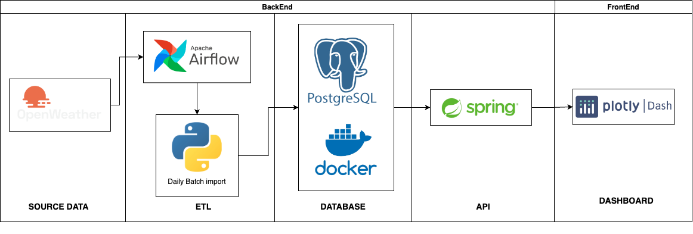

# AirQuality
## Table of Contents
1. [Motivation](#motivation)
2. [Overview](#overview)
3. [Installation](#installation)
4. [Usage](#usage)
6. [Contributing](#contributing)
7. [License](#license)

## Motivation
Living in the north of Italy, where air quality is among the poorest in Europe, has raised serious concerns for me. Dissatisfied with the available air quality monitoring websites, I took matters into my own hands. Using the OpenWeather API, I created a personalized dashboard to provide air quality data. My goal is simple: to empower individuals with the information they need to protect their health and make informed decisions in the face of air pollution challenges.

## Overview

Welcome to the AirQuality repository! This project is a personal endeavor aimed at analyze the quality of air in Italy according to different parameter. The technology used are the following:

* Python
* Docker
* Airflow
* Java Spring boot
* Dash Python
* Postgres

Overall the flow of the data is the following:

First a daily python script runned and managed by Airflow requests the air-pollution data of the previous day through the api of [openweather](https://openweathermap.org/api) then the data are store in a postgres database running on docker. Then to connect the backend with the Front end there are APIs created with SpringBoot. 

## Installation

To get started with this project, follow these simple steps:

1. **Clone the Repository:**
   
        git clone https://github.com/espodavide/airQuality.git
   
2. **Install Python Dependencies:**

       pip install -r requirements.txt

3. **Install Java Dependencies:**
   
   Move into the folder: BE/API/pollution-project

       mvn dependency
  
4. ** Install Postgress on docker **

    from docker  pull the image of postgress

       docker pull postgres
   
6. **Setup Configuration:**
  You need to create 2 json file in the folder: BE/ETL/airflow/dags/Scripts/config_file as follows:
  one for your API KEY "api_config.json":

        { "APP_ID": "XXXXXXX" } </code>

    One for your posgress configuration parameter "db_config.json":
      
        { "dbname" : "airpollutiondb",
          "user" : "XXXX",
          "password" : "XXXX",
          "host" : "localhost",
          "port" : "5432"    
          } </code>
  
    

## Usage

Here are some instructions on how to use the project:

1. **Run the Application:**
   
   In order to run the application you must lunch airflow:

        airflow standalone

   Launch docker with:

       docker run --name some-postgres -e POSTGRES_PASSWORD=mysecretpassword -d postgres

   Lunch the java spring boot project
3. **Access the Interface:**
   
   In localhost:8081 the dashboard can be seen. The port can be changed from the file FE/app.py 

## Contributing

Since this project is meant for personal use, I'm solely responsible for its development and maintenance. However, if you have any suggestions, feedback, or spot any issues, feel free to open an issue or reach out to me directly.

## License
This project is licensed under the MIT licence. For more details, please refer to the [MIT](https://choosealicense.com/licenses/mit/) file.

